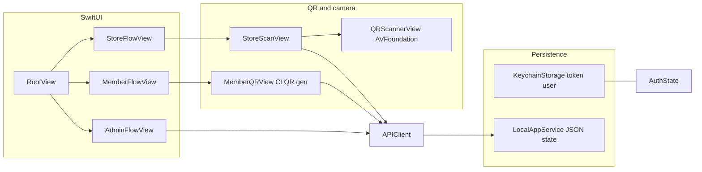

Group T39
### Kenneth Shifa
101523555

### Abrar Junaid Mohammed
101505643

### Shyan Pourahmed
101474651

### MD Tawsif Khan Siam
101515575

# Updated proposal: Anexcial iOS

**Course submission - revised design statement**  
**In-class presentation:** Thursday, April 16, 2026  

---

## Project summary

**Anexcial** is a native **SwiftUI** loyalty application (iOS 16+) with three roles: **Member** (store cards, points, rewards, visit history, personal QR for in-store identification), **Store** (dashboard, QR scanning and member lookup, award and redeem points, items, invites, onboarding, profile), and **Admin** (operations and governance). The product targets visual parity with the web experience through a shared **dark theme** (background `#17120f`, accent `#e0a458`).

---

## Baseline “original” scope vs current implementation

*Use this table to explain changes versus the design documented in the repo and initial feature brief. If your first course proposal added extra bullets, paste them in the empty subsection at the end.*

The following **baseline** is taken from [README.md](README.md) (project documentation), which describes the intended stack and feature set.

### UI

| Baseline (README / initial intent) | Current implementation | Change |
|-----------------------------------|-------------------------|--------|
| Same dark UI as the web app; colors `#17120f` / `#e0a458` | Centralized tokens in `Anexcial/Theme/Theme.swift` (background, surface, text, muted, accent, success, danger) | Moved from “match hex values in views” to a **single theme module** reused across screens. |
| “Same features and dark UI as the web app” | `RoleBadge` on Member, Store, and Admin tab flows; tab bar uses `Theme.surface`; accent via `.tint(Theme.accent)` | **Consistent navigation chrome** across roles. |
| — | `RootView` uses `.preferredColorScheme(.dark)` | **Explicit** dark appearance for the whole app. |
| — | After sign-in, a short **“Signed in as Member / Store / Admin”** banner (`RootView`) | **New UX feedback** so users confirm role after authentication. |

### Flow (navigation and roles)

| Baseline (README) | Current implementation | Change |
|-------------------|-------------------------|--------|
| Member: stores, rewards, My QR, profile | `MemberFlowView`: Tabs — **Stores**, **My QR**, **Profile** | Aligned; structure is explicit TabView. |
| Store: Dashboard, Scan, Invites, Items, Onboarding, More | `StoreFlowView`: **Dashboard**, **Scan**, **Invites**, **Items**, **More** | Aligned with README tab list. |
| Admin: “Onboarding review list, Approve/Reject” | `AdminFlowView`: **Dashboard**, **Users**, **Stores**, **Invites**, **Ops** (Members by store, Consultation leads, Onboarding review) | **Scope expansion:** Admin is broader than onboarding-only—includes metrics, user/store/invite management, and segmented operations. |

### Camera scanning (store)

| Baseline (README) | Current implementation | Change |
|-------------------|-------------------------|--------|
| Scan: “camera QR + member lookup, award points, redeem points” | `StoreScanView`: manual payload field, **Scan QR with camera** sheet, member lookup, item picker for **Award points**, **Redeem points** | Delivers README flow; camera is **AVFoundation**-based (`QRScannerView` / `QRScannerViewController`). |
| — | `Info.plist`: `NSCameraUsageDescription` | Required for App Store–style permission messaging. |

### QR (member + encoding)

| Baseline (README) | Current implementation | Change |
|-------------------|-------------------------|--------|
| My QR — show at store to earn points | `MemberQRView`: loads `member/qr/` payload and UUID; renders QR with **Core Image** `CIFilter.qrCodeGenerator()` | Generation is **on-device** from API-provided string; not a third-party QR SDK. |

### Database and persistence

| Baseline (README) | Current implementation | Change |
|-------------------|-------------------------|--------|
| Backend API: Django with `/api/`; default `http://127.0.0.1:8000/api/`; optional `ANEXCIAL_API_URL` in Info | Session: **Keychain** for token and cached user (`KeychainStorage`). App data: `APIClient` currently uses **`LocalAppService`** — an in-app **simulator** that persists state to a **JSON file** in the app documents directory (see `Networking/APIClient.swift`). | **Architectural pivot:** The shipping build demonstrates full UI and API *shape* against an **embedded local backend** for reliable offline demos and development. The README still describes **Django + SQLite** as the deployment target for production; **`ANEXCIAL_API_URL` is documented in README but not wired in Swift in this tree**—live HTTP would be a follow-on integration. |
| — | No Core Data for loyalty entities in this codebase | Persistence model is **Keychain + simulated JSON state** (current) vs **server DB** (documented). |

### Add your first formal proposal here (optional)

If the course’s original submission differed from README, add 2–4 bullets:

- *(Original claim 1:)*
- *(Original claim 2:)*
- *(What changed and why:)*

---

## Technical reference (file map)

| Area | Primary files |
|------|----------------|
| App shell / role routing | `Anexcial/App/RootView.swift` |
| Theme | `Anexcial/Theme/Theme.swift` |
| Member tabs | `Anexcial/Member/MemberFlowView.swift` |
| Store tabs + scan | `Anexcial/Store/StoreFlowView.swift`, `StoreScanView.swift`, `QRScannerView.swift` |
| Member QR | `Anexcial/Member/MemberQRView.swift` |
| Admin | `Anexcial/Admin/AdminFlowView.swift` |
| Networking / local state | `Anexcial/Networking/APIClient.swift`, `KeychainStorage.swift` |
| Camera privacy | `Anexcial/Info.plist` |

---

## Deliverables checklist (instructor requirements)

| Requirement | Status |
|-------------|--------|
| Updated proposal | This document |
| Explain changes vs original design | Sections above (baseline table + optional course proposal) |
| Video of final implementation | Script and checklist: [PRESENTATION_AND_VIDEO.md](PRESENTATION_AND_VIDEO.md) |
| Present in class (April 16, 2026) | Slide outline and timing: [PRESENTATION_AND_VIDEO.md](PRESENTATION_AND_VIDEO.md) |

---

## Architecture (overview)

---

## Future work (concise)

- Optional: implement **real HTTP** to Django using `ANEXCIAL_API_URL` and retire or gate `LocalAppService` for production builds.
- Optional: device testing matrix for **camera** (physical device required for meaningful QR scan demo).
